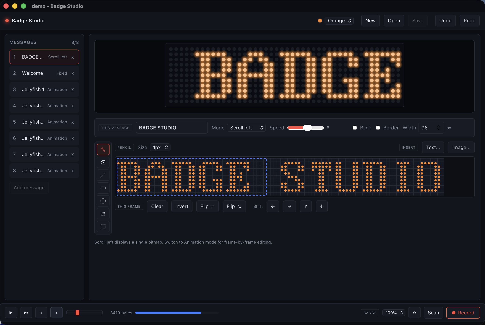
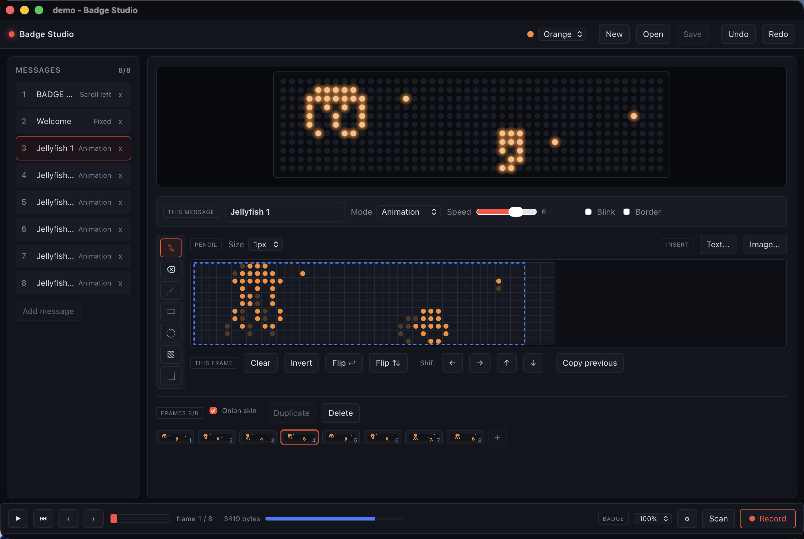

# Badge Studio

Design animations for the nyx v1 LED badge (WCH CH582, 44x11 monochrome
matrix) and upload them over USB or Bluetooth.

Runs on macOS, Windows and Linux, and works with the badge's stock firmware.
No reflashing is required.





## Download

Prebuilt packages are on the [Releases](../../releases) page.

| Platform | File |
|---|---|
| macOS (Apple Silicon) | `Badge.Studio_<version>_aarch64.dmg` |
| Windows | `Badge.Studio_<version>_x64-setup.exe` or `.msi` |
| Debian, Ubuntu | `.deb` |
| Fedora, RHEL | `.rpm` |
| Any Linux, portable | `.AppImage` |
| Linux, binary only | `.tar.gz` |

macOS builds are signed and notarized, and are Apple Silicon only. Intel Macs
need a build from source.

Windows builds are not signed, so SmartScreen warns on first run: choose "More
info", then "Run anyway".

Linux builds target glibc 2.35 (Ubuntu 22.04) and will not run on older
distributions. The `.deb` and `.rpm` declare their dependencies and are the
better choice; the `.tar.gz` is the bare executable and expects
`webkit2gtk-4.1` to be installed already.

## What the badge can hold

Eight message slots. Each is either a single bitmap or an animation of up to
eight frames, so a full sequence is 64 frames. The badge cycles the slots.

Each slot has its own display mode, speed and options:

| | |
|---|---|
| Modes | Scroll left, scroll right, scroll up, scroll down, fixed, animation, snowflake, picture, laser |
| Speed | 1 to 8 |
| Options | Blink, animated border |
| Brightness | 25%, 50%, 75%, 100%, set per upload |

Bitmaps can be wider than the 44px display. Scrolling modes use the extra
width; animation frames are a fixed 48px each.

## Drawing

Pencil, eraser, line, rectangle, ellipse, flood fill and a rectangular
selection you can drag, nudge, cut, copy and paste. Right-click erases with any
tool.

Text is stamped from bitmap faces drawn for an 11px display:

| Face | |
|---|---|
| Serif | The badge's own blocky face |
| Sans | Light and narrow, so more text fits across the badge |
| Cartoon | Rounded and hand-lettered, with a bounce between letters |
| Futuristic | Heavy and barred, with a break cut into the stems |

Every face covers Latin, Cyrillic and accented Latin, so a word never comes out
half in one face and half in another. Around 40 common emoji are included as
hand-drawn pictographs. **Emoji** in the text bar shows them as the badge will
draw them; they can also be typed or pasted straight in, from the system picker
or anywhere else. Faces are
chosen per stamp rather than per message, so one bitmap can mix them freely.

Faces are authored as pixel art in `fonts/*.face`, not as hex tables. Nobody can
review a letterform by reading `0x7C`. `fonts/build.py` generates the Rust
tables and `fonts/derive.py` builds each face's Cyrillic and accented Latin from
the letters it already has, so a face inherits its own weight and proportions
rather than borrowing another's.

Images can be imported with an adjustable black and white threshold.

The preview runs at the badge's real speed, so timing looks the same on screen
as it does on the hardware. A scrub bar steps through any animation or effect a
frame at a time.

## Connecting the badge

### USB

Connect the cable. The badge is detected automatically, a green **USB**
indicator appears, and **Record** uploads to it in well under a second.

On Linux the device is root-only until a udev rule grants access:

```bash
sudo cp 99-led-badge.rules /etc/udev/rules.d/
sudo udevadm control --reload-rules && sudo udevadm trigger
```

Unplug and reconnect the badge afterwards. macOS and Windows need no setup.

### Bluetooth

Used automatically when no cable is connected. The badge does not advertise
until you ask it to:

1. Unplug it from USB. It stays silent over Bluetooth while connected.
2. Press the first button. A Bluetooth icon appears when it is ready.

It drops out of Bluetooth mode after every upload, so step 2 has to be repeated
each time.

Bluetooth uploads are slow and can fail part-way on large animations. Prefer
USB for anything approaching 64 frames.

On macOS the first scan raises a system permission prompt.

## Documents

| Extension | Contains | Opening one |
|---|---|---|
| `.badge` | A whole project, up to 8 message slots | Replaces the current document |
| `.badgemsg` | A single message with its frames and settings | Inserts it into the current document |

Both are JSON, and both are registered as file associations, so double-click
and "Open With" work.

Work in progress is autosaved a few seconds after each edit and discarded on a
clean exit. If the application is found to have exited uncleanly, it offers to
restore that copy on the next launch.

## Keyboard

| Key | Action |
|---|---|
| `P` `E` `L` `R` `O` `F` `S` | Pencil, eraser, line, rectangle, ellipse, fill, select |
| `Cmd/Ctrl` + `Z` / `Shift+Z` | Undo / redo |
| `Cmd/Ctrl` + `C` / `X` / `V` / `A` | Copy / cut / paste / select all |
| Arrow keys | Nudge the selection, or jog the preview when nothing is selected |
| `Delete` | Erase inside the selection |
| `Esc` | Deselect |
| `Space` | Play or pause the preview |
| `Cmd/Ctrl` + `N` / `O` / `S` | New / open / save |
| `Cmd/Ctrl` + `Shift` + `S` | Save as |
| `Cmd/Ctrl` + `Q` | Quit |

## Building

Rust (stable) and Node.js 20.19 or newer, plus:

**macOS**

```bash
xcode-select --install
```

**Windows**

Microsoft C++ Build Tools, and the WebView2 runtime if you are on an older
Windows 10.

**Linux** (Debian and Ubuntu; adjust names for other distributions)

```bash
sudo apt install libwebkit2gtk-4.1-dev build-essential curl wget file \
  libxdo-dev libssl-dev libayatana-appindicator3-dev librsvg2-dev libudev-dev
```

Then:

```bash
cd badge-studio
npm install
npm run tauri dev            # run it
npm run tauri build          # build installers
npm test                     # editor and preview tests
cd src-tauri && cargo test   # encoder and font tests
```

Installers land in `badge-studio/src-tauri/target/release/bundle/`. Builds are
native only; cross-compiling between platforms is not supported.

### Cutting a release

Pushing a `v*` tag builds every platform and attaches the installers to a draft
GitHub release. The tag has to match the version in `package.json`,
`Cargo.toml` and `tauri.conf.json`, or the workflow stops before building.

```bash
git tag -a v1.2.3 -m "Badge Studio 1.2.3"
git push origin v1.2.3
```

The same workflow runs from the Actions tab without a tag, which builds
everything and leaves the results as workflow artifacts.

macOS builds are signed and notarized when these repository secrets are set,
and built unsigned when they are not:

| Secret | Value |
|---|---|
| `APPLE_CERTIFICATE` | Base64 of a "Developer ID Application" certificate exported as `.p12` |
| `APPLE_CERTIFICATE_PASSWORD` | The password set when exporting it |
| `APPLE_SIGNING_IDENTITY` | e.g. `Developer ID Application: Your Name (TEAMID)` |
| `APPLE_ID` | Apple ID used for notarization |
| `APPLE_PASSWORD` | An app-specific password, not the account password |
| `APPLE_TEAM_ID` | The 10-character team identifier |

`scripts/setup-macos-signing.sh` stores all six, reading the identity and team
ID from your keychain and piping the values straight to `gh secret set` so they
are never written to disk:

```bash
./scripts/setup-macos-signing.sh --check          # what is already set
./scripts/setup-macos-signing.sh certificate.p12  # set everything
```

## Protocol

[PROTOCOL.md](PROTOCOL.md) documents the wire format and both transports.

## License

Apache-2.0. See [LICENSE](LICENSE).
